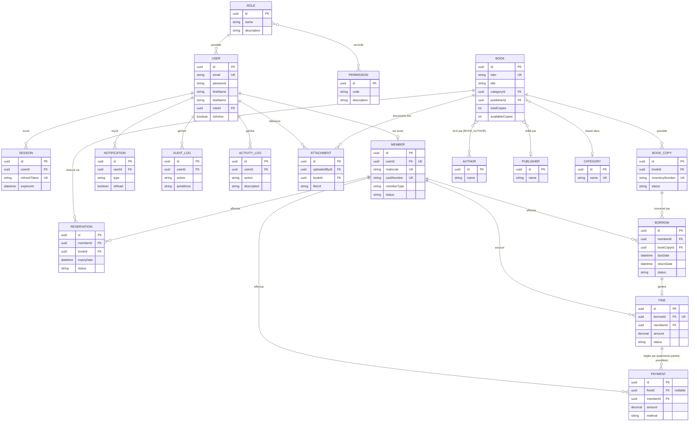

# Modèle Entité-Association (MER)

> Le modèle complet (20 entités, avec toutes les colonnes) est disponible dans
> [`backend/prisma/schema.prisma`](../../backend/prisma/schema.prisma), qui reste la **source de vérité**
> — ce diagramme est une vue simplifiée à but pédagogique.
