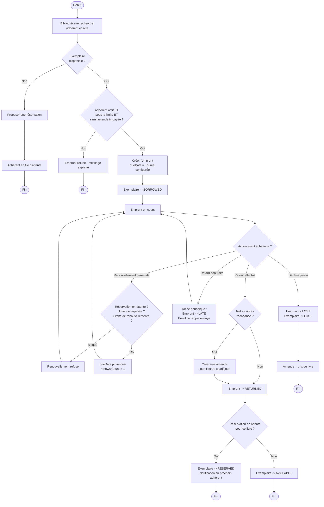

# Diagramme d'activité — Cycle de vie d'un emprunt

```mermaid
flowchart TD
    Start([Début]) --> Search[Bibliothécaire recherche adhérent et livre]
    Search --> CheckCopy{Exemplaire<br/>disponible ?}

    CheckCopy -->|Non| Reserve[Proposer une réservation]
    Reserve --> WaitQueue[Adhérent en file d'attente]
    WaitQueue --> End1([Fin])

    CheckCopy -->|Oui| CheckMember{Adhérent actif ET<br/>sous la limite ET<br/>sans amende impayée ?}
    CheckMember -->|Non| Reject[Emprunt refusé - message explicite]
    Reject --> End2([Fin])

    CheckMember -->|Oui| CreateBorrow[Créer l'emprunt<br/>dueDate = +durée configurée]
    CreateBorrow --> MarkBorrowed[Exemplaire -> BORROWED]
    MarkBorrowed --> Ongoing[Emprunt en cours]

    Ongoing --> Decision{Action avant échéance ?}
    Decision -->|Renouvellement demandé| CheckRenew{Réservation en attente ?<br/>Amende impayée ?<br/>Limite de renouvellements ?}
    CheckRenew -->|Bloqué| RenewRejected[Renouvellement refusé]
    RenewRejected --> Ongoing
    CheckRenew -->|OK| Renew[dueDate prolongée<br/>renewalCount + 1]
    Renew --> Ongoing

    Decision -->|Retour effectué| ComputeLate{Retour après<br/>l'échéance ?}
    ComputeLate -->|Non| CloseOk[Emprunt -> RETURNED]
    ComputeLate -->|Oui| CreateFine[Créer une amende<br/>joursRetard x tarif/jour]
    CreateFine --> CloseOk

    CloseOk --> CheckQueue{Réservation en attente<br/>pour ce livre ?}
    CheckQueue -->|Oui| OfferNext[Exemplaire -> RESERVED<br/>Notification au prochain adhérent]
    CheckQueue -->|Non| MarkAvailable[Exemplaire -> AVAILABLE]

    OfferNext --> End3([Fin])
    MarkAvailable --> End4([Fin])

    Decision -->|Déclaré perdu| MarkLost[Emprunt -> LOST<br/>Exemplaire -> LOST]
    MarkLost --> CreateLossFine[Amende = prix du livre]
    CreateLossFine --> End5([Fin])

    Decision -->|Retard non traité| AutoLate[Tâche périodique :<br/>Emprunt -> LATE<br/>Email de rappel envoyé]
    AutoLate --> Ongoing
```
