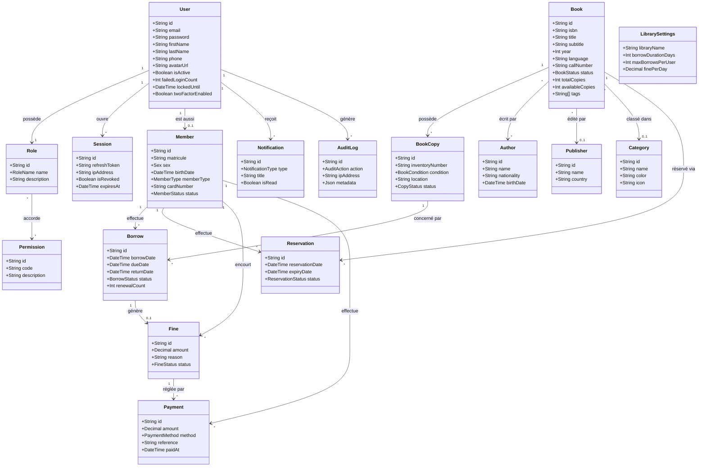

# Diagramme de classes

Reflet direct de `backend/prisma/schema.prisma` (20 modèles). Les attributs de gestion technique
(`createdAt`/`updatedAt`) sont omis par souci de lisibilité.

```mermaid
classDiagram
    class User {
        +String id
        +String email
        +String password
        +String firstName
        +String lastName
        +String phone
        +String avatarUrl
        +Boolean isActive
        +Int failedLoginCount
        +DateTime lockedUntil
        +Boolean twoFactorEnabled
    }

    class Role {
        +String id
        +RoleName name
        +String description
    }

    class Permission {
        +String id
        +String code
        +String description
    }

    class Session {
        +String id
        +String refreshToken
        +String ipAddress
        +Boolean isRevoked
        +DateTime expiresAt
    }

    class Member {
        +String id
        +String matricule
        +Sex sex
        +DateTime birthDate
        +MemberType memberType
        +String cardNumber
        +MemberStatus status
    }

    class Book {
        +String id
        +String isbn
        +String title
        +String subtitle
        +Int year
        +String language
        +String callNumber
        +BookStatus status
        +Int totalCopies
        +Int availableCopies
        +String[] tags
    }

    class BookCopy {
        +String id
        +String inventoryNumber
        +BookCondition condition
        +String location
        +CopyStatus status
    }

    class Author {
        +String id
        +String name
        +String nationality
        +DateTime birthDate
    }

    class Publisher {
        +String id
        +String name
        +String country
    }

    class Category {
        +String id
        +String name
        +String color
        +String icon
    }

    class Borrow {
        +String id
        +DateTime borrowDate
        +DateTime dueDate
        +DateTime returnDate
        +BorrowStatus status
        +Int renewalCount
    }

    class Reservation {
        +String id
        +DateTime reservationDate
        +DateTime expiryDate
        +ReservationStatus status
    }

    class Fine {
        +String id
        +Decimal amount
        +String reason
        +FineStatus status
    }

    class Payment {
        +String id
        +Decimal amount
        +PaymentMethod method
        +String reference
        +DateTime paidAt
    }

    class Notification {
        +String id
        +NotificationType type
        +String title
        +Boolean isRead
    }

    class AuditLog {
        +String id
        +AuditAction action
        +String ipAddress
        +Json metadata
    }

    class LibrarySettings {
        +String libraryName
        +Int borrowDurationDays
        +Int maxBorrowsPerUser
        +Decimal finePerDay
    }

    User "1" --> "1" Role : possède
    Role "*" --> "*" Permission : accorde
    User "1" --> "*" Session : ouvre
    User "1" --> "0..1" Member : est aussi
    User "1" --> "*" Notification : reçoit
    User "1" --> "*" AuditLog : génère

    Book "1" --> "*" BookCopy : possède
    Book "*" --> "*" Author : écrit par
    Book "*" --> "0..1" Publisher : édité par
    Book "*" --> "0..1" Category : classé dans

    Member "1" --> "*" Borrow : effectue
    Member "1" --> "*" Reservation : effectue
    Member "1" --> "*" Fine : encourt
    Member "1" --> "*" Payment : effectue

    BookCopy "1" --> "*" Borrow : concerné par
    Book "1" --> "*" Reservation : réservé via

    Borrow "1" --> "0..1" Fine : génère
    Fine "1" --> "*" Payment : réglée par
```
