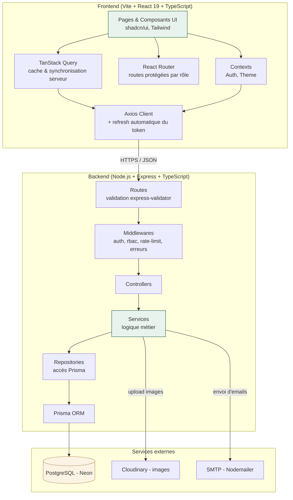

# Diagramme de composants

## Description des composants

| Composant | Responsabilité |
|---|---|
| **Pages & Composants UI** | Rendu, interactions utilisateur, formulaires (React Hook Form + Zod) |
| **TanStack Query** | Cache, invalidation, états de chargement/erreur, synchronisation avec le serveur |
| **Axios Client** | Requêtes HTTP, injection du token, rotation automatique sur 401 |
| **Routes (Express)** | Définition des endpoints REST, validation des entrées |
| **Middlewares** | Authentification JWT, autorisation RBAC, rate limiting, gestion centralisée des erreurs |
| **Services** | Toute la logique métier (règles d'emprunt, calcul d'amendes, file d'attente...) |
| **Repositories** | Seule couche autorisée à interroger Prisma — isole le reste de l'app du client ORM |
| **Prisma ORM** | Typage des requêtes, migrations, génération du client |
