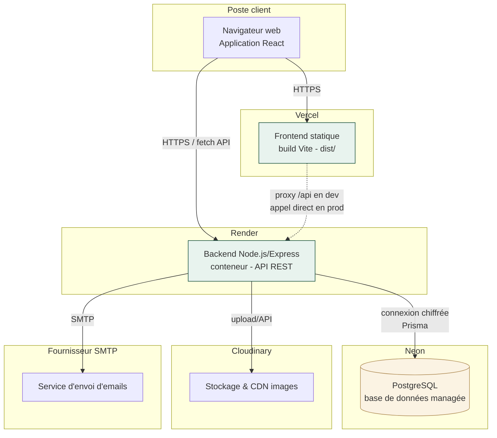

# Diagramme de déploiement

## Notes de déploiement

| Environnement | Plateforme | Détails |
|---|---|---|
| Frontend | **Vercel** | Build statique (`npm run build`), variable `VITE_API_URL` pointant vers l'API Render |
| Backend | **Render** | Service web Node.js, variables d'environnement (`.env` — voir guide d'installation), health check sur `/health` |
| Base de données | **Neon PostgreSQL** | Connexion via `DATABASE_URL`/`DIRECT_URL`, migrations Prisma exécutées au déploiement (`prisma migrate deploy`) |
| Stockage images | **Cloudinary** | Couvertures de livres, photos d'adhérents/auteurs, logo, QR codes |
| Emails | **SMTP** (ex. Gmail, SendGrid) | Réinitialisation de mot de passe, identifiants adhérents, rappels de retard |

Le frontend et le backend sont déployés indépendamment (repos ou dossiers séparés dans le même monorepo),
ce qui permet de les faire évoluer et scaler séparément — cohérent avec la séparation stricte posée
dès l'Étape 1 du projet.
