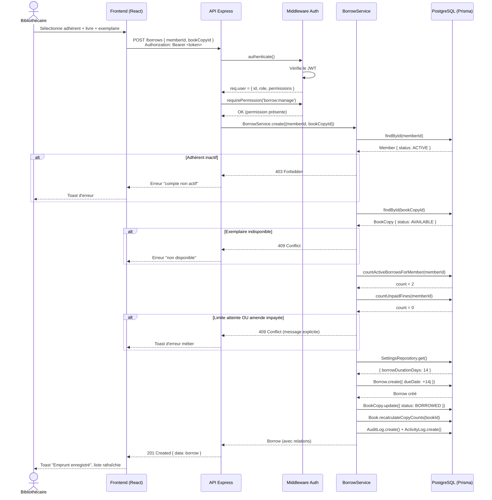

# Diagramme de séquence — Enregistrer un emprunt

Illustre l'échange complet entre le frontend, l'API et la base de données lors de la création
d'un emprunt (`POST /api/v1/borrows`), avec ses contrôles métier (Étape 6 du journal de développement).

