# Diagramme de cas d'utilisation

Trois acteurs interagissent avec le système : **Administrateur**, **Bibliothécaire**, **Lecteur** (adhérent).
L'Administrateur hérite de toutes les capacités du Bibliothécaire (relation UML `extends`/généralisation).

```mermaid
graph TB
    Admin([👤 Administrateur])
    Libr([👤 Bibliothécaire])
    Reader([👤 Lecteur / Adhérent])

    subgraph "Authentification"
        UC1[Se connecter / déconnecter]
        UC2[Réinitialiser mot de passe]
        UC3[Gérer son profil]
        UC4[Gérer ses sessions actives]
    end

    subgraph "Catalogue"
        UC5[Consulter le catalogue]
        UC6[Rechercher un livre]
        UC7[Gérer les livres - CRUD]
        UC8[Gérer les exemplaires]
        UC9[Gérer auteurs / éditeurs / catégories]
        UC10[Générer QR Code / couverture]
    end

    subgraph "Adhérents"
        UC11[Créer / gérer un adhérent]
        UC12[Consulter l'historique d'un adhérent]
        UC13[Suspendre / réactiver un adhérent]
    end

    subgraph "Circulation"
        UC14[Enregistrer un emprunt]
        UC15[Enregistrer un retour]
        UC16[Renouveler un emprunt]
        UC17[Déclarer un livre perdu]
        UC18[Réserver un livre]
        UC19[Annuler une réservation]
    end

    subgraph "Finances"
        UC20[Consulter les amendes]
        UC21[Encaisser un paiement]
        UC22[Remettre une amende]
    end

    subgraph "Pilotage"
        UC23[Consulter le tableau de bord]
        UC24[Générer des rapports]
        UC25[Exporter CSV / Excel / PDF]
        UC26[Consulter le journal d'audit]
        UC27[Configurer les paramètres]
    end

    Reader --> UC1
    Reader --> UC2
    Reader --> UC3
    Reader --> UC4
    Reader --> UC5
    Reader --> UC6

    Libr --> UC1
    Libr --> UC2
    Libr --> UC3
    Libr --> UC5
    Libr --> UC6
    Libr --> UC7
    Libr --> UC8
    Libr --> UC9
    Libr --> UC10
    Libr --> UC11
    Libr --> UC12
    Libr --> UC13
    Libr --> UC14
    Libr --> UC15
    Libr --> UC16
    Libr --> UC17
    Libr --> UC18
    Libr --> UC19
    Libr --> UC20
    Libr --> UC21
    Libr --> UC22
    Libr --> UC23
    Libr --> UC24
    Libr --> UC25

    Admin -.extends.-> Libr
    Admin --> UC26
    Admin --> UC27
```

## Description des principaux cas d'utilisation

| Cas d'utilisation | Acteur(s) | Pré-condition | Résultat |
|---|---|---|---|
| Enregistrer un emprunt | Bibliothécaire, Admin | Adhérent actif, exemplaire disponible, limite non atteinte, pas d'amende impayée | Emprunt créé, exemplaire marqué `BORROWED` |
| Enregistrer un retour | Bibliothécaire, Admin | Emprunt en cours | Emprunt clôturé, amende générée si retard, réservation suivante proposée si file d'attente |
| Réserver un livre | Bibliothécaire, Admin (pour le compte d'un adhérent) | Aucun exemplaire disponible | Réservation `PENDING` créée |
| Encaisser un paiement | Bibliothécaire, Admin | Amende `UNPAID`/`PARTIALLY_PAID` | Paiement enregistré, statut de l'amende mis à jour |
| Générer un rapport | Bibliothécaire, Admin | Permission `report:view` | Données affichées + export possible |
| Consulter le journal d'audit | Admin uniquement | Rôle `ADMIN` | Liste des événements de sécurité |
